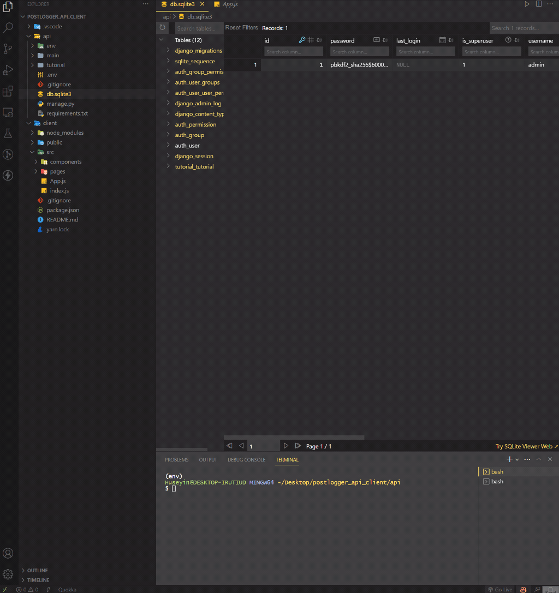

<div align=center>
	<h1>Post Logger API & Client</h1>
</div>

<div align="center">
	
</div>

## Description

Simple API system for a basic post database using Django and its UI with React. End-user can do CRUD operations on UI created with React.

## Goals

Practicing on models, field types, rest framework, model serializers, overriding validate method on serializers, model viewsets, overriding create and perform_create methods on CreateModelMixin(modelviewset), defaultrouter, corsheaders to establish connection between backend and frontend, cors_allow_origins and cors_allow_methods, connecting backend to React.

## Installation

To run this app on your local, run commands below on the terminal:

1. Clone main repo on your local.

    ```shell
    $ git clone https://github.com/ehkarabas/django-exercises.git
    ```

2. On this sub-repo, open terminal in ./api for the backend and:

	2.1. Make sure you've installed python and added python to the system path.


	2.2. Install python environment to this sub-repo.

	    ```shell
	    $ python -m venv env
	    ```

	2.3. Activate python environment.

	    ```shell
	    For powershell:
	    $ .\env\Scripts\activate

	    For git bash:
	    $ source env/Scripts/activate

	    For linux/mac:
	    $ source env/bin/activate
	    ```

	2.4. Install required packages to this sub-repo.

	    ```shell
	    $ python install -r requirements.txt
	    ```

	2.5. Run the server on your browser.

	    ```shell
	    $ python manage.py runserver
	    ```

3. On this sub-repo, open terminal in ./client for the frontend and:

	3.1. Install node modules to this sub-repo.

	    ```shell
	    $ yarn install

	    or

	    $ npm install
	    ```

	3.2. Run the app on your browser.

	    ```shell
	    $ yarn start

	    or

	    $ npm start
	    ```


## Resource Structure 

```
postlogger_api_client(folder)
|
|-- README.md
|-- api
|   |-- db.sqlite3
|   |-- main
|   |   |-- __init__.py
|   |   |-- __pycache__
|   |   |   |-- __init__.cpython-311.pyc
|   |   |   |-- settings.cpython-311.pyc
|   |   |   |-- urls.cpython-311.pyc
|   |   |   |-- wsgi.cpython-311.pyc
|   |   |-- asgi.py
|   |   |-- settings.py
|   |   |-- urls.py
|   |   |-- wsgi.py
|   |-- manage.py
|   |-- requirements.txt
|   |-- tutorial
|       |-- __init__.py
|       |-- __pycache__
|       |   |-- __init__.cpython-311.pyc
|       |   |-- admin.cpython-311.pyc
|       |   |-- apps.cpython-311.pyc
|       |   |-- models.cpython-311.pyc
|       |   |-- serializers.cpython-311.pyc
|       |   |-- urls.cpython-311.pyc
|       |   |-- views.cpython-311.pyc
|       |-- admin.py
|       |-- apps.py
|       |-- migrations
|       |   |-- 0001_initial.py
|       |   |-- __init__.py
|       |   |-- __pycache__
|       |       |-- 0001_initial.cpython-311.pyc
|       |       |-- __init__.cpython-311.pyc
|       |-- models.py
|       |-- serializers.py
|       |-- tests.py
|       |-- urls.py
|       |-- views.py
|-- client
|   |-- package.json
|   |-- public
|   |   |-- favicon.ico
|   |   |-- index.html
|   |   |-- logo192.png
|   |   |-- logo512.png
|   |   |-- manifest.json
|   |   |-- robots.txt
|   |-- src
|   |   |-- App.js
|   |   |-- components
|   |   |   |-- AddTutorial.jsx
|   |   |   |-- EditTutorial.jsx
|   |   |   |-- TutorialList.jsx
|   |   |-- index.js
|   |   |-- pages
|   |       |-- Home.jsx
|   |-- yarn.lock
|-- presentation
    |-- postlogger_api_client-presentation.gif
```


