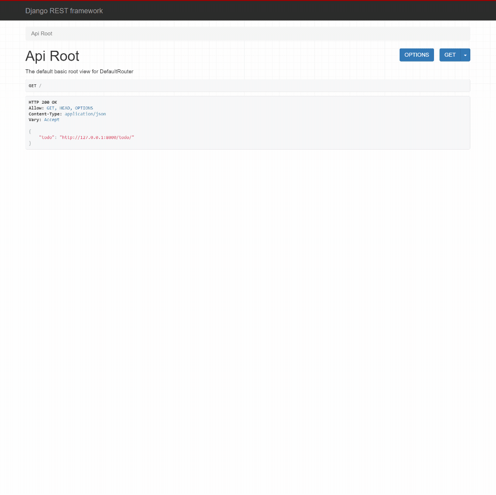

<div align=center>
	<h1>To-Do Django</h1>
</div>

<div align="center">
	
</div>

## Description

Simple API system for a basic to-do list using Django.

## Goals

Practicing on models, field types, rest framework, model serializers, model viewsets, defaultrouter.

## Installation

To run this app on your local, run commands below on the terminal:

1. Clone main repo on your local.
    ```shell
    $ git clone https://github.com/ehkarabas/django-exercises.git
    ```

2. Make sure you've installed python and added python to the system path.


3. Install python environment to this sub-repo.
    ```shell
    $ python -m venv env
    ```

4. Activate python environment.
    ```shell
    For powershell:
    $ .\env\Scripts\activate
    
    For git bash:
    $ source env/Scripts/Activate

    For linux/mac:
    $ source env/bin/activate
    ```

5. Install required packages to this sub-repo.
    ```shell
    $ python install -r requirements.txt
    ```

6. Run the server on your browser.
    ```shell
    $ python manage.py runserver
    ```

## Resource Structure 

```
todo-django(folder)
|
|-- README.md
|-- db.sqlite3
|-- main
|   |-- __init__.py
|   |-- __pycache__
|   |   |-- __init__.cpython-311.pyc
|   |   |-- settings.cpython-311.pyc
|   |   |-- urls.cpython-311.pyc
|   |   |-- wsgi.cpython-311.pyc
|   |-- asgi.py
|   |-- settings.py
|   |-- urls.py
|   |-- wsgi.py
|-- manage.py
|-- presentation
|   |-- todo-django-presentation.gif
|-- requirements.txt
|-- todo
    |-- __init__.py
    |-- __pycache__
    |   |-- __init__.cpython-311.pyc
    |   |-- admin.cpython-311.pyc
    |   |-- apps.cpython-311.pyc
    |   |-- models.cpython-311.pyc
    |   |-- serializers.cpython-311.pyc
    |   |-- views.cpython-311.pyc
    |-- admin.py
    |-- apps.py
    |-- migrations
    |   |-- 0001_initial.py
    |   |-- __init__.py
    |   |-- __pycache__
    |       |-- 0001_initial.cpython-311.pyc
    |       |-- __init__.cpython-311.pyc
    |-- models.py
    |-- serializers.py
    |-- tests.py
    |-- urls.py
    |-- views.py
```


